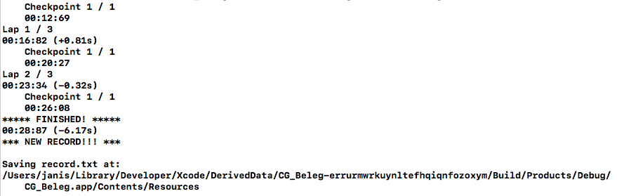

# OpenGL Car Racing Game 
In diesem Projekt haben wir ein kleines Autorennspiel gebaut.

## Features
- Steuerung des Autos
- Straßenrundkurs
- Checkpoints und Ziellinie
- Rundenzeiten und Gesamtzeit
- Geist der schnellsten Gesamtzeit
- Skybox

## Steuerung
- `↑` forwärts fahren
- `↓` rückwärts fahren 
- `←` nach links lenken 
- `→` nach rechts lenken 
- `leertaste` bremsen

## Straßenrundkurs
Die Straße und die Landschaft wurde mit Maya erstellt und als .fbx 3D-Modell exportiert und dann mit ASSIMP in das Programm eingebunden.

## Checkpoints, Ziellinie und Zeiten
Auf der Rennstrecke gibt es eine Ziellinie und einen Checkpoint, diese werden genutzt um die Rundenzeiten und Zwischenzeiten zu ermitteln. Die Zeiten werden auf der Konsole ausgegeben. Nach einem kompletten Rennen, was standardmäßig aus 3 Runden besteht wird die Gesamtzeit mit der aktuellen Bestzeit verglichen, falls noch keine Bestzeit existiert oder die aktuelle Zeit schneller ist, wird die aktuelle Zeit gespeichert.

Die erste Gesamtzeit wurde als neue Bestzeit gespeichert.

Die neue Gesamtzeit ist besser als die alte Bestzeit und wird bei jedem Checkpoint mit der alten Gesamtzeit verglichen, am Ende wird die neue Gesamtzeit als neue Bestzeit festgehalten und in die Datei geschrieben.

## Geist
Während der Fahrt wird die Position des Autos ständig gespeichert und in eine Datei geschrieben. Falls eine neue Bestzeit entstanden sein sollte, oder noch keine Bestzeit existiert wird für das nächste Rennen aus den gespeicherten Positionen des Autos ein Geist erstellt, der die Rennstrecke entsprechend der Datei abfährt.
